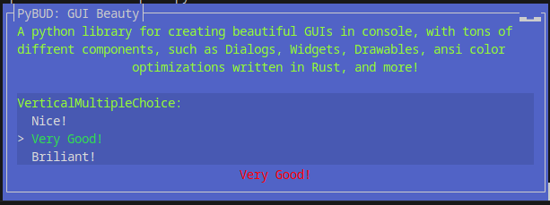
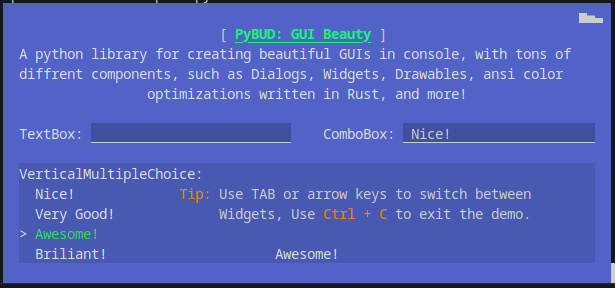

# PyBUD: Python Beauty

[](https://www.codefactor.io/repository/github/amiralimollaei/pybud-gui) [](https://pypi.org/project/pybud-gui/)

**A python library for creating beautiful GUIs in console, optimized with a Rust backend, with tons of different modules, such as `Drawer`, `Session`, `Window`s, `Widget`s, and many more!**


---
## Installation:

to install using pip:

```
pip install pybud-gui -U
```

or if you want to install from source:

```
pip install git+https://github.com/amiralimollaei/pybud-gui.git
```

## Documentation:

#### Table of Contents:

- [Build Your First Window](#build-your-first-window)

- [Add Your First Widget](#add-your-first-widget)

- [Exmaples](#examples)

---

### Build Your First Window

First import moduels:

```python
from pybud.session import Session
from pybud.window import Window
```

You can think of `Session` as a display monitor, the display has a refresh rate (`session.TPS`) and size (`datatypes.Size`), and can show multiple `Window`s on it.

Next, build the main class:

```python
class Main(Window):
    def __init__(self):
        super().__init__(
            size = (100, 10),
            position = (0, 0),
            title = "Window Example",
        )
```

And finally, show the window:

```python
# only for windows users
import pybud.drawer.ansi as ansi
ansi.init()

# add `Main` to session and show
s = Session((100, 10), background=(100, 100, 250))
s.add_window(Main())
s.show()
```

Output:

> 

### Add Your First Widget

First import moduels:

```python
from pybud.session import Session
from pybud.window import Window
from pybud.widgets import Label
# using `ansi` module you can define colored text with graphics
from pybud.drawer import ansi
```

Next, build the Main class just like above, but add a `Label` widget.

```python
# build the main window
class Main(Window):
    def __init__(self):
        super().__init__(
            size = (50, 9),
            position = (0, 0),
            title = "Colored Text Example",
        )

        # add a label widget, set text, width and position
        self.add_widget(Label(
            # define a ansi.AnsiString object that renders text with colors
            # you can set both forecolor and backcolor
            text = ansi.AnsiString("Hello world!", fore = (90, 250, 90)),
            position = (19, 4),
            size = (60, 1)
            )
        )
```

And finally, show the window:

```python
# only for windows users
import pybud.drawer.ansi as ansi
ansi.init()

# add `Main` to session and show
s = Session((50, 9), background=(100, 100, 250))
s.add_window(Main())
s.show()
```

Output:
>

### Advanced Exmaples

Advanced Example 1:
>

Advanced Example 2:
>

---

Written in 2025, License: `BSD 4-clause License`
